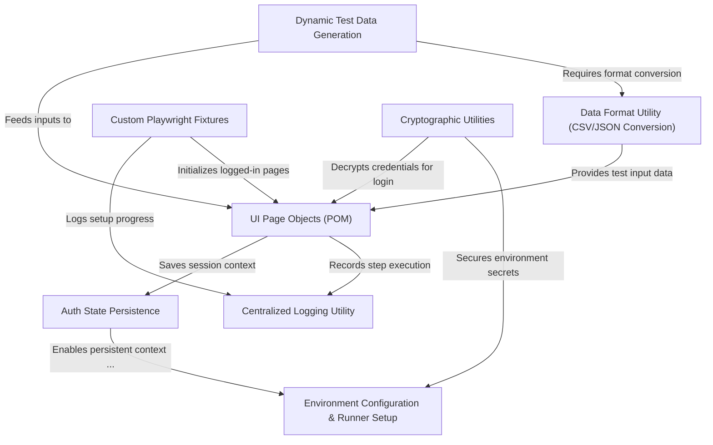
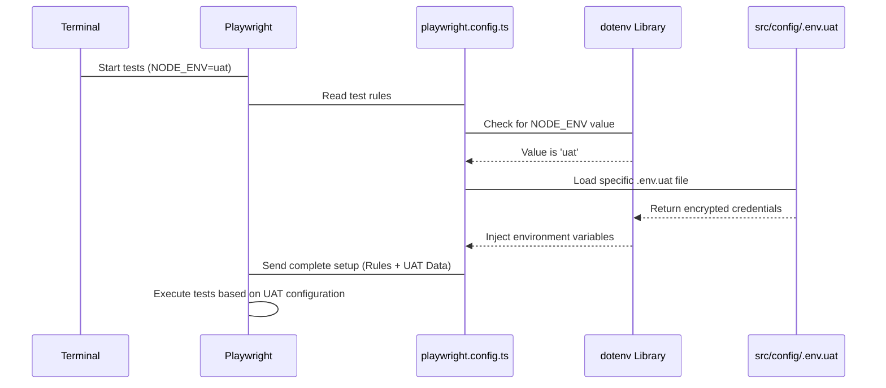
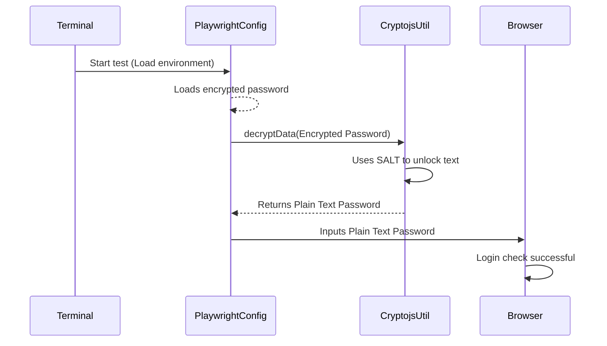
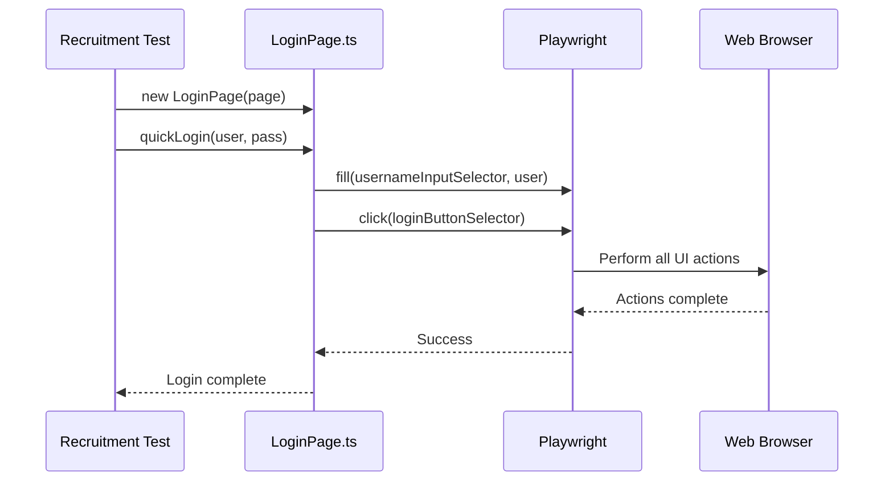
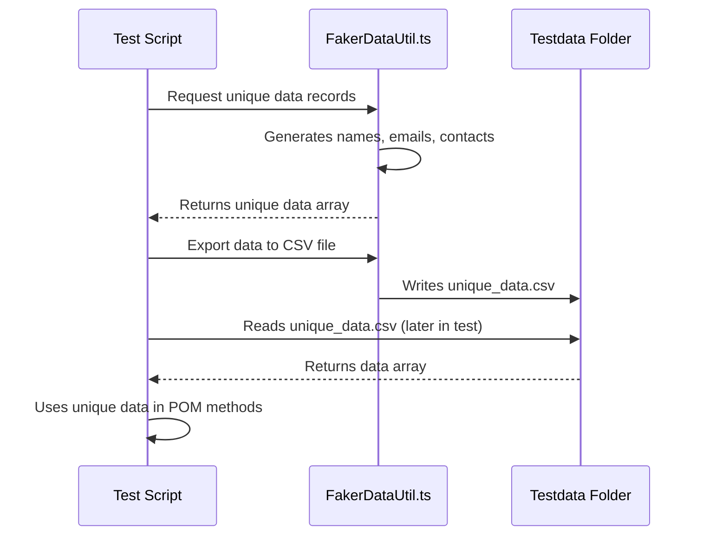
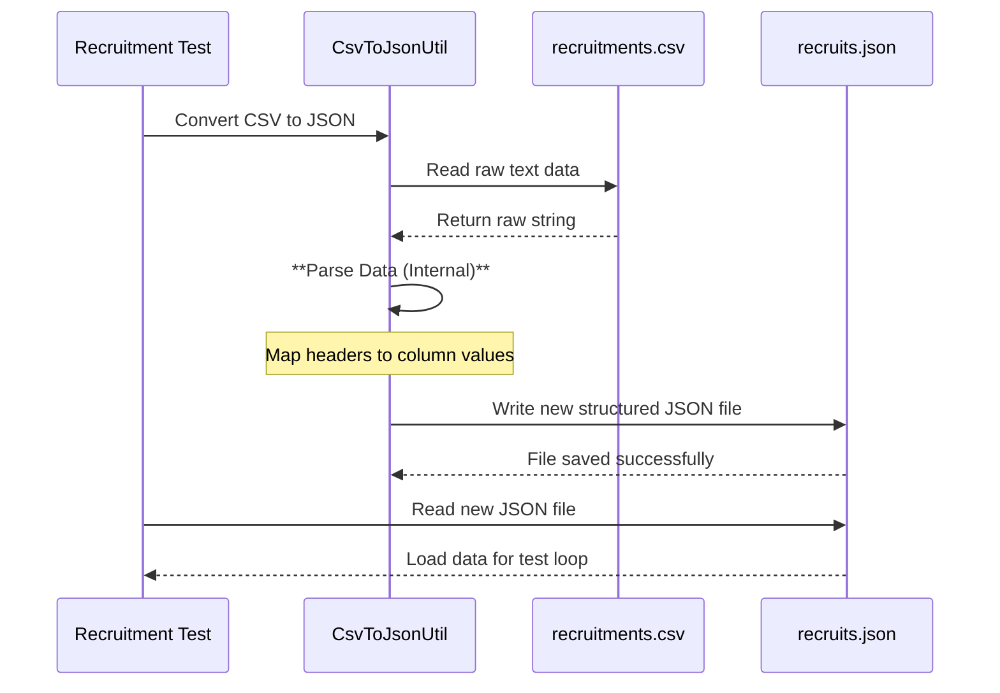
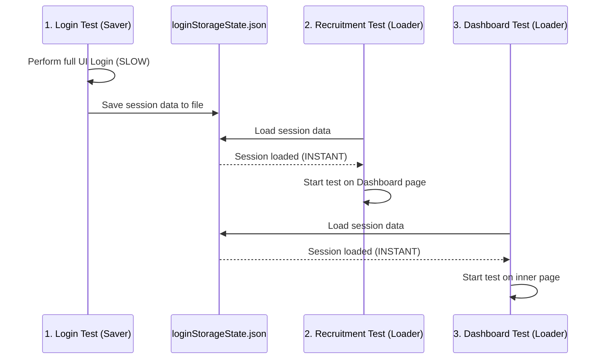
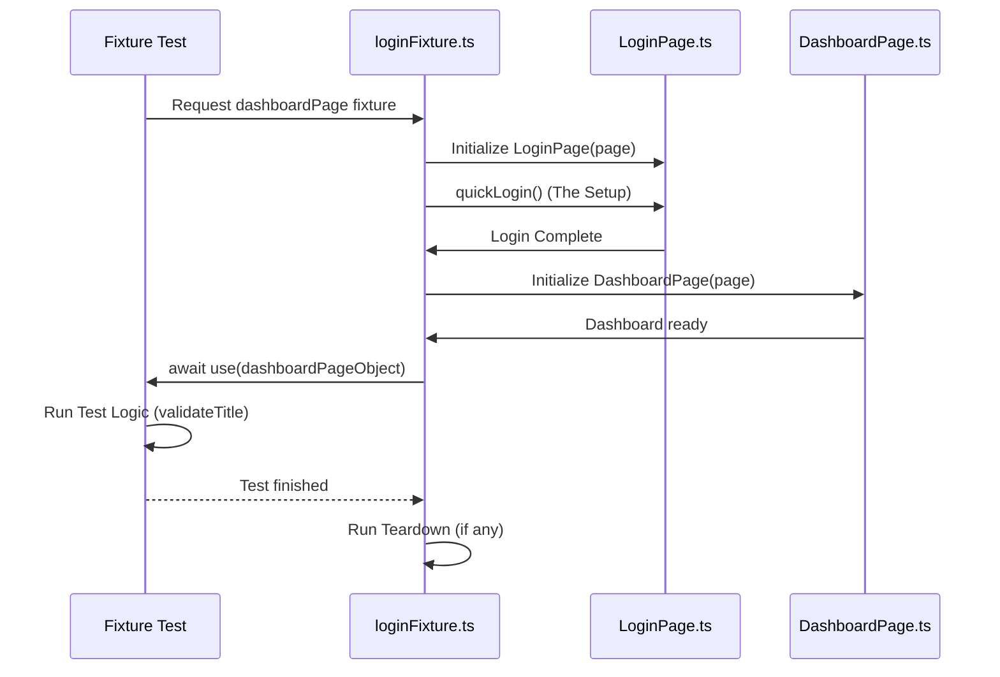
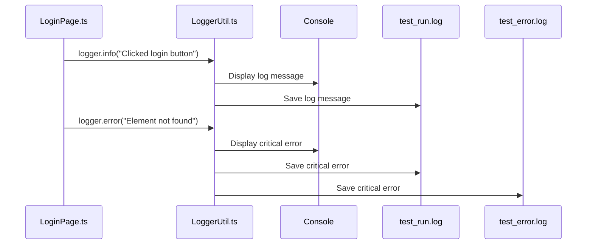

# PlaywrightTSAutomation

This project implements a **Playwright TypeScript automation framework** focused on testing the OrangeHRM application.
It leverages a structured *Page Object Model (POM)* and sophisticated mechanisms like *dynamic data generation* (using Faker) and CSV/JSON transformation to drive tests efficiently.
Key features include **secure handling of sensitive credentials** via encryption and accelerated test runs through *authentication state persistence* and *custom Playwright fixtures*.


## Visual Overview



## Sections

1. [Environment Configuration & Runner Setup
](01_environment_configuration___runner_setup_.md)
2. [Cryptographic Utilities
](02_cryptographic_utilities_.md)
3. [UI Page Objects (POM)
](03_ui_page_objects__pom__.md)
4. [Dynamic Test Data Generation
](04_dynamic_test_data_generation_.md)
5. [Data Format Utility (CSV/JSON Conversion)
](05_data_format_utility__csv_json_conversion__.md)
6. [Auth State Persistence
](06_auth_state_persistence_.md)
7. [Custom Playwright Fixtures
](07_custom_playwright_fixtures_.md)
8. [Centralized Logging Utility
](08_centralized_logging_utility_.md)

---

# section 1: Environment Configuration & Runner Setup

Before we start writing tests, we need to set the ground rules for *how* our tests will run and *what* data they should use.

Imagine you are the captain of a fleet of testing robots. This section focuses on setting up your mission control panel: the **`playwright.config.ts`** file. This single file defines global instructions for your robots, such as how fast they should work and where they should look for sensitive credentials.

## The Core Problem: Setting Rules and Credentials

We face two main challenges that this configuration solves:

1.  **Global Test Rules:** How many times should a failed test automatically retry? Should the browser run visibly? These are global rules that apply to every test run.
2.  **Dynamic Credentials:** We need different usernames and passwords when testing locally (Development) versus when testing on a dedicated testing server (UAT/Staging). We must load the correct credentials automatically.

Let's look at how the `playwright.config.ts` file handles these needs.

---

## 1. Defining the Test Runner Setup

The primary role of `playwright.config.ts` is to configure the Playwright Test Runner—the engine that runs your tests.

### Controlling Global Behavior

We use settings like `retries`, `workers`, and `headless` to manage efficiency and reliability.

```typescript
// playwright.config.ts (Global Runner Settings)
export default defineConfig({
  testDir: './src/tests', // Where Playwright looks for tests
  fullyParallel: true,    // Run tests simultaneously for speed
  retries: 2,             // Retry failed tests up to 2 times
  workers: process.env.CI ? 1 : undefined, // Reduce workers on CI server
  reporter: 'html',       // Generates a nice HTML report
  use: {
    baseURL: 'https://opensource-demo.orangehrmlive.com/web/index.php/',
    headless: false, // Set to false to watch the browser actions
  },
  // ... projects and other settings omitted
});
```

**Key Takeaways from the Runner Setup:**

*   **`retries: 2`**: If a test fails due to a temporary network glitch, Playwright automatically tries it two more times before marking it as truly failed. This significantly improves stability.
*   **`headless: false`**: This is fantastic for development. It means the browser window will actually pop up, allowing you to watch your test robot interact with the UI. (On continuous integration servers like GitHub, this usually defaults to `true` for speed).
*   **Workers**: We limit the number of simultaneous workers (`workers: 1`) only when running on a Continuous Integration (CI) server (using `process.env.CI`). This saves server resources when running in the cloud.

---

## 2. Dynamic Environment Configuration (The Credentials Problem)

Imagine you have two vaults of passwords: one for local testing (simple, easy-to-use credentials) and one for UAT (real, sensitive, often encrypted credentials). We need a system to choose the right vault based on *where* the test is running.

### Using `.env` Files

We use two separate files to store environment variables (credentials):

1.  **Development Vault (`src/config/.env`):** Used when running locally.
    ```
    username=Admin
    password=admin123
    ```
2.  **UAT Vault (`src/config/.env.uat`):** Used when running against the UAT environment. Notice the passwords here are encrypted (we'll learn how to handle this in [Cryptographic Utilities](02_cryptographic_utilities_.md)).
    ```
    username=U2FsdGVkX18iPjZCviCifkDG2ao/uhTo3Pjf+QMe6SE=
    password=U2FsdGVkX19+wcJ9xCa5VEs7RyY+OctqFd2tioA0Vts=
    ```

### The Selector: `NODE_ENV`

The way we tell Playwright which vault to open is by using a special variable called `NODE_ENV`.

Inside `playwright.config.ts`, we use a simple check to decide which `.env` file to load using the `dotenv` library:

```typescript
// playwright.config.ts (Dynamic .env Loading)
import dotenv from 'dotenv';

// 1. Check if NODE_ENV is set (e.g., 'uat')
if(!process.env.NODE_ENV) { 
  // 2. If no environment is specified, load default
  dotenv.config({ path: `${__dirname}//src//config//.env` });
} else {
  // 3. Load the specific environment file
  dotenv.config({ path: `${__dirname}//src//config//.env.${process.env.NODE_ENV}` });
}
```

This logic means your execution command dictates the environment:

| Execution Command | Environment Loaded |
| :--- | :--- |
| `npx playwright test` | Loads `src/config/.env` (Development) |
| `NODE_ENV=uat npx playwright test` | Loads `src/config/.env.uat` (UAT) |

---

## 3. How the Configuration Runner Works

When you type the command to run your tests, the system performs a sequence of checks and setups defined in section 1.

The following diagram illustrates the flow when you specify the `uat` environment:


In short, `playwright.config.ts` runs first, grabs the environment secrets, and then tells Playwright how to handle the test execution.

---

# section 2: Cryptographic Utilities

In [section 1: Environment Configuration & Runner Setup](01_environment_configuration___runner_setup_.md), we established the foundational setup, including how to dynamically load configuration variables from different environment files (like `.env` for Development and `.env.uat` for UAT).

Crucially, we stored the UAT passwords in a **scrambled, encrypted format** for security:

```
password=U2FsdGVkX19+wcJ9xCa5VEs7RyY+OctqFd2tioA0Vts=
```

If our test robot tries to use that long, jumbled string as a password, the login will fail! The application expects the actual, plain text password.

## The Core Problem: Securing Credentials

**The purpose of Cryptographic Utilities is to solve this security dilemma:**

1.  **Requirement 1 (Security):** Store sensitive credentials (like API keys and passwords) securely in configuration files, preventing unauthorized access if the files are viewed.
2.  **Requirement 2 (Functionality):** Decrypt these credentials automatically *at the exact moment* the test needs to use them, so the test input is correct.

We manage this using two utilities: the **Decryption Utility** (used during the test run) and the **File Management Utility** (used once to encrypt the environment file).

---

## 1. The Decryption Utility (`CryptojsUtil.ts`)

The Decryption Utility is the key tool used within your actual test files. Its job is simple: take an encrypted string and return the original, usable string.

### The Secret Key: SALT

All encryption relies on a secret code known only to the encryption and decryption process. In our system, this secret code is called the **SALT**.

The SALT is required to unlock the password. It is stored as an environment variable and ensures that even if someone finds your encrypted `.env` file, they cannot decrypt the values without knowing the SALT.

### Using Decryption in a Test

When we retrieve a password from the configuration (`process.env.password`), we immediately pass it to the `decryptData` function before using it in the application.

Let's look at how this happens inside a test file:

```typescript
// src/tests/loginTest.spec.ts (Snippet)
import { decryptData } from "../utils/CryptojsUtil"; 

test('Secure Login Test', async ({page}) => {
    // 1. Get the encrypted value from the environment file
    const encryptedPassword = process.env.password!; 
    
    // 2. Decrypt the value using the utility
    const plainTextPassword = decryptData(encryptedPassword);

    // 3. Now, use the decrypted, plain text password
    await loginPage.fillPassword(plainTextPassword);
    
    // ... continue test ...
});
```
This is the only change required for the test code to handle encrypted credentials!

### How Decryption Works

Our utility uses the industry-standard `crypto-js` library. The `decryptData` function requires two things: the encrypted string and the secret `SALT`.

```typescript
// src/utils/CryptojsUtil.ts (Simplified)
const CryptoJSUtil = require("crypto-js"); 
// Load the secret key (SALT)
const SALT = process.env.SALT || "defaultSalt"; 

export function decryptData(ciphertext: string): string {
  // 1. Use the AES algorithm to decrypt the text 
  //    using the secret SALT
  const bytes = CryptoJSUtil.AES.decrypt(ciphertext, SALT);
  
  // 2. Convert the resulting output back into readable text format
  const originalText = bytes.toString(CryptoJSUtil.enc.Utf8);
  return originalText;
}
```

---

## 2. The Runtime Decryption Flow

When you run a test that requires a decrypted credential, the following sequence of events occurs:



This confirms that the password is only decrypted in memory just before being used, ensuring maximum security while maintaining test functionality.

---

## 3. File Management Utility (Encryption/Decryption)

If we encrypt our production credentials, how do we get them encrypted in the first place? We don't want to do this by hand!

We use a separate script, `EncryptEnvFile.ts`, which automatically processes the entire configuration file for us.

### Encrypting the File

This utility performs the following steps when you execute it:

1.  Reads the plain text values from the target `.env` file (e.g., `username=Admin`).
2.  Encrypts the value (e.g., `Admin` becomes `U2FsdGVk...`).
3.  Overwrites the original `.env` file with the encrypted contents.

This script is run manually *one time* when configuring a new secure environment.

```typescript
// src/utils/EncryptEnvFile.ts (Core Logic Snippet)
export function encryptEnvFile() {
  // ... reads environment file path ...
  
  const envFileContent = fs.readFileSync(envFilePath, "utf8");
  const envLines = envFileContent.split("\n");

  // Loop through every line in the file
  const encryptedLines = envLines.map((envLine) => {
    const [key, value] = envLine.split("=");

    if (value) {
      // Encrypt the value using the SALT
      const encryptedValue = CryptoJSUtil.AES.encrypt(value, SALT).toString();
      return `${key}=${encryptedValue}`; // Return the encrypted key/value pair
    }
    return envLine;
  });

  // Write all new, encrypted lines back to the file
  fs.writeFileSync(envFilePath, encryptedLines.join("\n"), "utf8");
}
```

A companion function, `decryptEnvFile()`, exists to reverse this process, converting all credentials back to plain text if necessary for local debugging or configuration updates.

| Utility | Purpose | When is it used? |
| :--- | :--- | :--- |
| **`decryptData()`** | Unlocks a single variable during a test run. | Every time the test runs. |
| **`encryptEnvFile()`** | Locks an entire configuration file. | Once, during initial setup. |

---

# section 3: UI Page Objects (POM)

In the previous section, [Cryptographic Utilities](02_cryptographic_utilities_.md), we ensured our test robots can securely log into the OrangeHRM application by automatically decrypting sensitive credentials.

Now, our robots are ready to start interacting with the website. But how do we tell them *how* to interact with the different pages (like the Login screen, the Dashboard, or the Recruitment section) in a clean and organized way?

## The Core Problem: Messy Tests

Imagine you are writing a test to log in and add a candidate. If you put every single interaction directly into your test file, it would quickly become a huge, unreadable script:

```typescript
// test/recruitmentTest.spec.ts (Bad Example - Too much detail!)

test('Add Candidate Test', async ({ page }) => {
    // Login Details:
    await page.goto('/auth/login');
    await page.locator('input[name="username"]').fill('Admin');
    await page.locator('input[name="password"]').fill('admin123');
    await page.locator('button[type="submit"]').click();

    // Navigate to Recruitment:
    await page.getByRole('link', { name: 'Recruitment' }).click();

    // Add Candidate Details:
    await page.getByRole('button', { name: 'Add' }).click();
    await page.getByPlaceholder('First Name').fill('Alice');
    // ... 15 more lines of clicking and filling inputs ...
});
```
If the developer changes the selector for the "First Name" input, you have to update every single test file that uses that input! This makes maintenance a nightmare.

## The Solution: UI Page Objects (POM)

The **Page Object Model (POM)** solves this by creating dedicated classes (blueprints) for every major page of your application.

Think of a Page Object as the **dedicated remote control** for a specific screen in OrangeHRM.

| Page Object | What it controls | Example Actions |
| :--- | :--- | :--- |
| `LoginPage` | The Login Screen | `quickLogin()`, `fillUsername()` |
| `DashboardPage` | The Main Landing Page | `navigateToRecruitmentTab()`, `validateTitle()` |
| `RecruitmentPage` | The Candidate Management Screen | `addCandidate()`, `findExistingCandidateByName()` |

Each Page Object class encapsulates two things:

1.  **Locators (The "Where"):** All the selectors for elements on that page.
2.  **Methods (The "How"):** All the actions you can perform on that page.

---

## 1. Building a Page Object: The LoginPage Example

Let's look at how we structure the `LoginPage` class located in `src/pages/LoginPage.ts`.

### Step 1: Define the Locators (The "Where")

We start by identifying the elements we need to interact with on the page and storing their selectors as class properties.

```typescript
// src/pages/LoginPage.ts (Locators)
import { Page } from "@playwright/test";

export class LoginPage {
    // 1. We store the Playwright Page object passed from the test
    constructor(private page: Page) {} 

    // 2. Define Locators (selectors)
    private readonly usernameInputSelector = 'input[name="username"]';
    private readonly passwordInputSelector = 'input[name="password"]'
    private readonly loginButtonSelector = 'button[type="submit"]';
}
```

**Why this is better:** If the developer changes the username input from `input[name="username"]` to `input[id="user"]`, you only have to change *one line* here, and all your login tests are automatically updated!

### Step 2: Define the Methods (The "How")

Next, we write methods that use those locators to perform meaningful actions. These methods describe the "business logic" of the page.

```typescript
// src/pages/LoginPage.ts (Methods)
// ... locators and constructor omitted ...

    async navigateToLoginPage() {
        await this.page.goto('auth/login');
    }

    async fillUsername(username: string) {
        await this.page.locator(this.usernameInputSelector).fill(username);
    }
    
    async clickLoginButton() {
        await this.page.locator(this.loginButtonSelector).click();
    }

    async quickLogin(username: string, password: string) {
        await this.navigateToLoginPage();
        await this.fillUsername(username);
        await this.fillPassword(password);
        await this.clickLoginButton();
    }
}
```
The `quickLogin` method is powerful because it combines three low-level actions into one highly readable command.

---

## 2. Using Page Objects in the Test

Now that we have our dedicated remote control (`LoginPage`), look how clean and simple our test file becomes (in `src/tests/recruitmentTest.spec.ts`):

### Before POM (Messy)

```typescript
// Test file: Too detailed!
// await page.locator('input[name="username"]').fill(user);
// await page.locator('button[type="submit"]').click();
```

### With POM (Clean and Readable)

```typescript
// src/tests/recruitmentTest.spec.ts (Clean Usage)
import { LoginPage } from "../pages/LoginPage"; 

test('Recruitment Test Login', async ({ browser }) => {
    const page = await browser.newPage();
    
    // 1. Create the Page Object "Remote Control"
    const loginPage = new LoginPage(page); 

    // 2. Execute the high-level action
    await loginPage.quickLogin(process.env.username!, process.env.password!);
    
    // Test continues onto the DashboardPage...
});
```
This test script is now focused purely on *what* the test is trying to achieve (logging in), not *how* the login is technically implemented (which selectors to use).

---

## 3. How Page Objects Work in the Flow

When you execute a test using a Page Object, the flow is simply delegating the responsibility for UI actions from the test file to the corresponding Page Object class.

Let's visualize the action `loginPage.quickLogin()`:


The Page Object acts as the intermediary, preventing the Test File from needing to know any details about the website's structure.

### Example: Chaining Page Objects

A powerful concept is chaining Page Objects. When one action (like logging in) takes you to a new page (the Dashboard), the `LoginPage` method can return the new `DashboardPage` object, instantly giving the test access to the new screen's remote control.

In our system, the `DashboardPage` is navigated to after login. We handle this transition in the test itself:

```typescript
// Test using chained objects
// ... login completed ...

// We create the next Page Object to continue the interaction:
const dashboardPage: DashboardPage = new DashboardPage(page);
await dashboardPage.expectDashboardTitleToBeVisible();

// Navigate to the next page using a Page Object Method:
const recruitmentPage: RecruitmentPage = await dashboardPage.navigateToRecruitmentTab();

// recruitmentPage is now the Page Object for the Recruitment screen.
await recruitmentPage.addCandidate(data); 
```
This clearly outlines the user's journey through the application, improving test readability immensely.

---

# section 4: Dynamic Test Data Generation

In [section 3: UI Page Objects (POM)](03_ui_page_objects__pom__.md), we built the remote controls for our web pages, ensuring our tests know *how* to click and fill in forms.

Now we face a crucial question: **What data do we put into those forms?**

If we are constantly running a test to hire a new candidate, we might use the name "Jane Doe" the first time. The second time, the application will likely reject the input because "Jane Doe already exists" in the system!

## The Core Problem: Static Data Collision

Tests that rely on the same, static data (data that never changes) are fragile:

1.  **They are not repeatable:** The test fails after the first successful run because the required record already exists.
2.  **They pollute the database:** Using the same production-like data (e.g., specific employee IDs or order numbers) can interfere with other systems or tests.

## The Solution: The Data Factory

To solve this, we use **Dynamic Test Data Generation**. We don't use hardcoded data; instead, we use a utility that acts as a "Data Factory," inventing perfectly realistic and, most importantly, **unique** data every time the test runs.

In the `PlaywrightTSAutomation` project, this factory is powered by the popular library `faker`.

---

## 1. Inventing Unique Test Profiles

Our central utility, `FakerDataUtil.ts`, handles the job of generating unique profiles needed for our recruitment tests: names, emails, and contact numbers.

### A. Generating a Single Record

We define a function that calls specific methods from the `faker` library to invent a complete profile on demand.

```typescript
// src/utils/FakerDataUtil.ts (Core Logic)
import { faker } from "@faker-js/faker"; 

const generateRecruitmentData = () => {
    return {
        // Invents a unique name, e.g., "Max"
        firstname: faker.person.firstName(),
        // Invents a unique last name, e.g., "Power"
        lastname: faker.person.lastName(),   
        // Invents a unique, valid-looking email
        email: faker.internet.email(),       
        // Invents a 10-digit number
        contactNo: faker.string.numeric(10)  
    };
};
```

Every time you call `generateRecruitmentData()`, you get a brand new, unique candidate profile!

### B. Generating Multiple Records

If we want to test bulk actions (e.g., adding 5 candidates), we use a helper function to create an array of data.

```typescript
// src/utils/FakerDataUtil.ts (Array Generation)
export const generateRecruitmentDataArray = (noOfRecords: number) => {
    // This tells faker to run the generation function 'noOfRecords' times
    const dataArray = faker.helpers.multiple(generateRecruitmentData, { 
        count: noOfRecords 
    });
    return dataArray;
};

// Example usage: generateRecruitmentDataArray(3) 
// Output: [ {firstname: "A"}, {firstname: "B"}, {firstname: "C"} ]
```

---

## 2. Using Generated Data in Tests

We can now integrate this unique data generation directly into our test file (`src/tests/serialTest.spec.ts`).

### Step 1: Generate the Data

First, we generate a small batch of unique candidates.

```typescript
// src/tests/serialTest.spec.ts (Snippet)
import { generateRecruitmentDataArray, RecruitmentData } from "../utils/FakerDataUtil";
// ... imports omitted ...

test('Recruitment Faker testData generation', async () => {
    // Generate 1 unique candidate profile
    const testData = generateRecruitmentDataArray(1);
    
    // We will save this data for later use (Step 2)
    exportRecruitmentDataToJsonFile(testData, "testData_en.json"); 
});
```

### Step 2: Running the Test Loop

After generating the data, we use a loop to pass each unique record into our Page Object Model (POM) methods, like the `addCandidate` action we defined in [section 3: UI Page Objects (POM)](03_ui_page_objects__pom__.md).

```typescript
// src/tests/serialTest.spec.ts (Snippet)

test('Add Recruitment Candidate using Faker data', async () => {
    // recruitmentJsonData holds the unique data array read from the file
    // ... setup and reading file skipped ...

    // Iterate through every unique record generated
    for (const data of recruitmentJsonData) {
        const recruitmentPage = await dashboardPage.navigateToRecruitmentTab();
        
        // Pass the unique data into the POM method
        await recruitmentPage.addCandidate(
            data.firstname,
            data.lastname, 
            data.vacancy, 
            data.email, 
            data.contactNo
        );
    };
});
```

Because the data is unique every time, this test can run hundreds of times without failing due to data collision!

---

## 3. Advanced Utility: Exporting Data to Files

While we could generate and use the data immediately in memory, saving the data to a file (like JSON or CSV) offers huge benefits:

1.  **Debugging:** You can check the exact name and email that failed a test.
2.  **Reusability:** Other scripts or even manual testers can use the exact data set created.
3.  **Data-Driven Testing:** This prepares the data for use in complex test scenarios.

### Saving as JSON

We use `fs` (Node.js File System) to write the generated array to a file in the dedicated `src/testdata` folder.

```typescript
// src/utils/FakerDataUtil.ts (Exporting JSON)
import fs from "fs";
import path from "path";
// ... path setup omitted ...

export const exportRecruitmentDataToJsonFile = (dataArray, fileName: string) => {
    const jsonFilePath = path.join(testdataDir, fileName);
    // Writes the data in a human-readable, structured format
    fs.writeFileSync(jsonFilePath, JSON.stringify(dataArray, null, 2), 'utf8');
    console.log(`Generated JSON file at: ${jsonFilePath}`);
};
```

### Saving as CSV

We also support exporting to CSV, which is a common format for sharing bulk data. This requires a dedicated CSV library.

```typescript
// src/utils/FakerDataUtil.ts (Exporting CSV)
import * as createCsvWriter from "csv-writer";
// ... path setup omitted ...

export const exportRecruitmentDataToCsvFile = async (dataArray, fileName: string) => {
    const csvFilePath = path.join(testdataDir, fileName);
    
    // Set up the columns (headers)
    const csvWriter = createCsvWriter.createObjectCsvWriter({
        path: csvFilePath,
        header: [
            { id: 'firstname', title: 'firstname' },
            // ... other headers omitted ...
        ],
    });
    // Write all the records to the file
    await csvWriter.writeRecords(dataArray);
};
```

---

## 4. The Dynamic Data Generation Workflow

The following diagram illustrates how your test requests unique data from the utility and how that data is saved and used.


This utility ensures the crucial first step of a reliable test: having unique, high-quality input data.

---

# section 5: Data Format Utility (CSV/JSON Conversion)

In [section 4: Dynamic Test Data Generation](04_dynamic_test_data_generation_.md), we learned how to use the `faker` library to invent new, unique data and save it into files like JSON or CSV.

But often, test data isn't generated by us. It might be provided by a Quality Assurance (QA) team or a Business Analyst in a massive, legacy spreadsheet format—typically a **CSV file** (Comma Separated Values).

The problem is that Playwright and TypeScript prefer to work with **JSON data** (an array of JavaScript objects) because it is highly structured and easy to iterate over in a test loop.

## The Core Problem: Format Dependency

If your required test data exists in a CSV file, how do you easily feed that data into your Page Object Model (POM) methods ([section 3: UI Page Objects (POM)](03_ui_page_objects__pom__.md))?

You need a way to translate the simple, table-like structure of CSV into the complex, object-based structure of JSON *before* the test starts.

## The Solution: The Data Format Translator

Our **Data Format Utility (`CsvToJsonUtil.ts`)** acts as a file translator. It standardizes test input by taking any structured CSV file and converting it into a standard JSON array that our TypeScript tests can instantly consume.

### Use Case: Reading CSV Candidates

Imagine we have a standard CSV file listing candidates to hire:

```csv
# src/testdata/recruitments.csv
firstname,lastname,vacancy,email
John,Black,Junior Account Assistant,john.b@demo.com
Jane,White,Junior Account Assistant,jane.w@demo.com
```

Our goal is to convert this into a JSON structure like this, which is ready for use in a test loop:

```json
[
  {
    "firstname": "John",
    "lastname": "Black",
    "vacancy": "Junior Account Assistant",
    "email": "john.b@demo.com"
  },
  {
    "firstname": "Jane",
    "lastname": "White",
    "vacancy": "Junior Account Assistant",
    "email": "jane.w@demo.com"
  }
]
```

## 1. Introducing the Conversion Utility

The core function in our utility, `convertCsvFileToJsonFile`, handles the entire process: reading the input file, converting the data row-by-row, and writing the structured output file.

We call this function once, typically at the very beginning of the test file, before any actual test cases run.

### The Conversion Workflow

The utility runs a simple, four-step process to perform the translation:



### Using the Utility in the Test File

In your test script (`src/tests/recruitmentTest.spec.ts`), you simply import the utility and tell it what to convert:

```typescript
// src/tests/recruitmentTest.spec.ts (Snippet)
import { convertCsvFileToJsonFile } from "../utils/CsvToJsonUtil";
import fs from 'fs';
// ... other imports ...

// We run the conversion before the tests even begin!
convertCsvFileToJsonFile('recruitments.csv', 'test_candidates.json');

// Now, load the brand new JSON file into memory for the test loop
const dataArray = JSON.parse(fs.readFileSync(jsonFilePath, 'utf8'));

// Test script can now loop through dataArray
dataArray.forEach((data, index) => {
    test(`Testing Candidate #${index}`, async () => {
        // data.firstname and data.lastname are now available!
        await recruitmentPage.addCandidate(data.firstname, data.lastname);
    });
});
```

By calling `convertCsvFileToJsonFile`, you ensure that the required test data is always in the optimal format (JSON) right when the test needs it.

## 2. Under the Hood: The Parsing Logic

The core magic happens inside the `parseCsvToJson` function within `src/utils/CsvToJsonUtil.ts`. This function is responsible for correctly assigning the column headers (keys) to the row values.

### Step 1: Defining the Main Function

This function handles file operations (reading and writing).

```typescript
// src/utils/CsvToJsonUtil.ts (Main Function)
export const convertCsvFileToJsonFile = (
    csvFileName: string, 
    jsonFileName: string, 
    delimiter = ','
) => {
    // 1. Set the file paths
    const csvPath = path.join(testdataDir, csvFileName);
    const jsonPath = path.join(testdataDir, jsonFileName);

    // 2. Read the raw text data from the CSV file
    const csvData = fs.readFileSync(csvPath, 'utf8');

    // 3. Call the internal parser to do the hard work
    const jsonData = parseCsvToJson(csvData, delimiter);

    // 4. Write the resulting array of objects to the output JSON file
    fs.writeFileSync(jsonPath, JSON.stringify(jsonData, null, 2));

    console.log(`Conversion saved to: ${jsonPath}`);
};
```

### Step 2: Mapping Headers to Values

The `parseCsvToJson` function is responsible for the actual translation logic. It breaks the raw text into lines and then matches the first line (headers) with the subsequent lines (values).

```typescript
// src/utils/CsvToJsonUtil.ts (Parsing Core)
function parseCsvToJson(csvData: string, delimiter: string = ','): CsvRow[] {
    // 1. Split the raw text into separate lines
    const lines = csvData.split('\n');

    // 2. The first line contains the column names (headers)
    const headers = lines[0].split(delimiter).map(h => h.trim());

    // 3. Process every line starting from the second line (data rows)
    return lines.slice(1).map((line) => {
        const values = line.split(delimiter);
        const row: CsvRow = {};

        // 4. Loop through the headers and assign the corresponding value
        headers.forEach((header, index) => {
            // e.g., row['firstname'] = values[0]
            row[header] = values[index]?.trim() ?? ''; 
        });

        return row; // Returns one complete JavaScript object (JSON record)
    });
}
```

This internal loop is crucial because it transforms unstructured, raw text data into the structured, name-keyed data objects that TypeScript and Playwright require for reliable data-driven testing.

## Summary of Data Formats

| Format | Structure | Used For | Strengths |
| :--- | :--- | :--- | :--- |
| **CSV** | Tabular (Rows and Columns) | Sharing/Input from external sources | Simple, readable in spreadsheets. |
| **JSON** | Array of JavaScript Objects | Consuming data in TypeScript tests | Structured, native to JS environment. |

The Data Format Utility ensures you are never blocked by the format of your input data, allowing you to seamlessly integrate large datasets, whether they were generated dynamically ([section 4: Dynamic Test Data Generation](04_dynamic_test_data_generation_.md)) or provided externally.

---

# section 6: Auth State Persistence

In the previous sections, we established the core elements of a robust test suite: secure configuration ([section 1: Environment Configuration & Runner Setup](01_environment_configuration___runner_setup_.md)), organized UI interactions ([section 3: UI Page Objects (POM)](03_ui_page_objects__pom__.md)), and dynamic data generation ([section 4: Dynamic Test Data Generation](04_dynamic_test_data_generation_.md)).

Our system can now reliably log in and perform complex actions. But there's a problem: **Speed.**

If you have 50 tests, and every single test starts by clicking the username field, typing, clicking the password field, typing, and clicking the login button, you might waste 5 seconds per test—or over 4 minutes in total—just on logging in! This is inefficient and slows down your development cycle.

## The Core Problem: Wasted Time on Login

Running the UI login steps repeatedly for every single test is time-consuming and fragile (if the login page fails, all 50 tests fail).

## The Solution: Auth State Persistence (Storage State)

**Auth State Persistence** is a feature that allows us to bypass the slow, physical UI login step for subsequent tests.

Think of it like getting a **VIP Pass** at an exclusive club.

1.  **First Visit (The Setup Test):** You show your ID and credentials, and they verify you (the slow UI login).
2.  **The Reward (Saving the State):** Once inside, the club gives you a special VIP wristband (a small JSON file called the **Storage State**). This wristband contains your session credentials (cookies and tokens).
3.  **Next Visits (Subsequent Tests):** You simply show the wristband at the door, and you are instantly let inside, skipping the whole line and verification process!

By saving the browser's "logged-in status" to a file, tests can load that status instantly, saving valuable execution time.

---

## 1. Step 1: Logging In and Saving the State

We run a single, dedicated test whose only job is to perform a successful login and then save the resulting session data.

We define a specific file path for our saved state, typically `src/config/loginStorageState.json`.

```typescript
// src/tests/loginStorageStateTest.spec.ts (Saving Session)
import { test } from "@playwright/test";
import { LoginPage } from "../pages/LoginPage";

const authFile = 'src/config/loginStorageState.json';

test('Login and Save State', async ({ page }) => {
    const loginPage = new LoginPage(page);
    
    // 1. Perform the full UI login (Takes 5 seconds)
    await loginPage.quickLogin(
        process.env.username!, 
        process.env.password!
    );
    
    // 2. Playwright saves the session data (cookies, tokens) to the file
    await page.context().storageState({ path: authFile });
    
    console.log(`Auth Storage state saved to ${authFile}`);
});
```

**What happens here:** Playwright captures all the crucial internal information that proves the browser is logged in (like cookies and local storage items) and bundles them into the `loginStorageState.json` file.

> **Security Note:** Since this file holds sensitive session information, it is crucial that it is tracked in your `.gitignore` file, ensuring it is never accidentally uploaded to your version control system (like GitHub).

---

## 2. Step 2: Loading the State for Subsequent Tests

Now that we have our VIP Pass (`loginStorageState.json`), we can use it for every test that requires a logged-in user.

To use the storage state, we must create a special **Browser Context**. A context is like a temporary, isolated browser session. When we create the context, we tell it to load our session file immediately.

```typescript
// src/tests/loginStorageStateTest.spec.ts (Loading Session)
const authFile = 'src/config/loginStorageState.json';

test('Use Storage State for Fast Access', async ({ browser }) => {
    // 1. Create a new context and load the saved state file
    const context = await browser.newContext({ 
        storageState: authFile 
    });
    
    // 2. Open a new page within this pre-authenticated context
    const page = await context.newPage();
    
    // 3. Navigate directly to an inner page! (Bypassing login page)
    await page.goto('/recruitment/viewCandidates');
    
    // Test continues instantly on the internal page...
});
```

Because the `page` was created within a context that loaded the stored session, when it tries to access an internal URL (`/recruitment/viewCandidates`), the application immediately sees the authentication tokens and allows access, skipping the need to show the login screen.

---

## 3. The Performance Difference Flow

This method drastically changes the workflow for running tests, moving from a sequential, time-intensive process to an efficient, session-reusing process.

### Traditional (Slow) Flow vs. Persistence (Fast) Flow

| Feature | Traditional Flow | Auth State Persistence Flow |
| :--- | :--- | :--- |
| **Login Time (Test 1)** | 5 seconds (UI interaction) | 5 seconds (UI interaction) |
| **Login Time (Test 2+)** | 5 seconds (UI interaction) | **0 seconds** (File load) |
| **Test Stability** | Low (dependent on UI login functioning) | High (only dependent on saved file) |
| **Action** | Must navigate to Login URL | Can navigate directly to Dashboard URL |

### The Workflow Diagram

The following diagram shows how the system shifts from doing the work repeatedly to doing it once and saving the result:


Only the first test pays the cost of the login time; all subsequent tests enjoy immediate access.

---

## 4. Automation Best Practice: Using Fixtures

While the method above works perfectly, continuously writing `const context = await browser.newContext({ storageState: authFile });` and `const page = await context.newPage();` in every test file can get repetitive.

The best practice in Playwright is to encapsulate this loading logic into a **Custom Playwright Fixture**. This allows us to define the "logged-in context" once, and then any test can simply request a `loggedPage` object, and Playwright automatically knows to load the storage state and create the page for it.

This technique simplifies the test files even further:

```typescript
// Test file using Custom Fixture (Simplified)

// Note: We don't need to manually load the file!
test('Fast recruitment test', async ({ loggedPage }) => {
    // loggedPage is already logged in, thanks to the fixture!
    await loggedPage.goto('/recruitment/viewCandidates');
    
    // ... test continues instantly ...
});
```
We will explore exactly how to build and use these powerful Custom Playwright Fixtures in the very next section.

---

# section 7: Custom Playwright Fixtures

In [section 6: Auth State Persistence](06_auth_state_persistence_.md), we learned how to save a logged-in browser session (the "Storage State") to skip slow UI login steps. This was a massive speed boost!

However, we noted that manually loading the storage state and setting up the page context in every single test file is repetitive:

```typescript
// Repetitive code in every test...
test('My Test', async ({ browser }) => {
    // 1. Manually load state file
    const context = await browser.newContext({ storageState: authFile });
    // 2. Manually create the page
    const page = await context.newPage(); 
    // 3. Manually create the Page Object
    const dashboardPage = new DashboardPage(page);
    // ... Now the test can start ...
});
```
This is boilerplate code that we don't want to write repeatedly.

## The Core Problem: Boilerplate Setup

Every test that starts from the dashboard needs the exact same complex setup: load the page, log in (or load the storage state), and initialize the `DashboardPage` object ([section 3: UI Page Objects (POM)](03_ui_page_objects__pom__.md)).

If we have 100 tests, we have 100 copies of this setup code!

## The Solution: Custom Playwright Fixtures

**Custom Playwright Fixtures** are the ultimate tool for solving boilerplate setup.

A fixture is essentially a function that performs complex setup tasks (like logging in) and then provides the finished, fully initialized resource (like an already-logged-in `DashboardPage` object) directly to the test.

**Think of a fixture as a concierge service:** You ask for `dashboardPage`, and the fixture handles everything necessary to deliver a browser page that is *already* logged in and ready on the dashboard.

## 1. Defining the Custom Fixture (`loginFixture.ts`)

We define our custom fixtures in a separate file, `src/fixtures/loginFixture.ts`.

### Step 1: Extending Playwright's Base `test`

We start by importing the standard Playwright `test` and using the `.extend()` method. This tells Playwright we are adding new, custom resources (fixtures) that tests can request.

We define a `type` called `UIPages` to clearly list the resources we are creating.

```typescript
// src/fixtures/loginFixture.ts (Simplified Structure)
import {test as base} from "@playwright/test"; 
import { DashboardPage } from "../pages/DashboardPage";
import { LoginPage } from "../pages/LoginPage";

// 1. Define the type of resource we are creating
type UIPages = {
    // We are creating a resource called 'dashboardPage'
    dashboardPage: DashboardPage; 
};

// 2. Extend the base 'test' with our new type
export const test = base.extend<UIPages>({
    // ... fixture definitions go here ...
});
```

### Step 2: Implementing the `dashboardPage` Fixture

The fixture function has two parts:

1.  **Setup (Before `await use()`):** The code that runs *before* the test starts. This includes the login logic.
2.  **Usage (The `use` callback):** The resource we give to the test.
3.  **Teardown (After `await use()`):** The cleanup code that runs *after* the test finishes.

Let's look at the implementation:

```typescript
// src/fixtures/loginFixture.ts (The Fixture Logic)
// ... type definition and imports omitted ...

export const test = base.extend<UIPages>({
    dashboardPage: async ({ page }, use) => {
        // --- 1. SETUP: Perform Login and Initialization ---
        const loginPage = new LoginPage(page);
        
        // This is the login boilerplate we are abstracting away!
        await loginPage.quickLogin(process.env.username!, process.env.password!);
        
        // Initialize the final Page Object Model (POM) object
        const dashboardPageObject = new DashboardPage(page);
        await dashboardPageObject.waitForLoad(); // Wait for page stability
        
        // --- 2. USAGE: Provide the finished resource ---
        await use(dashboardPageObject);
        
        // --- 3. TEARDOWN (Optional): Cleanup after test ---
        // (Nothing needed here, but you could log out, etc.)
    }
});
```

**Key concept: The `use` function.** When Playwright hits `await use(dashboardPageObject)`, it pauses the setup, runs the actual test that requested the fixture, and then resumes any code *after* `use` (the teardown).

## 2. Using the Custom Fixture in a Test

To use the custom fixture, we must import the **custom `test` function** from our fixture file instead of the default `@playwright/test`.

Look how incredibly clean the test becomes!

```typescript
// src/tests/fixtureTest.spec.ts (Clean Usage)
import {test} from "../fixtures/loginFixture";
import logger from "../utils/LoggerUtil";

// Playwright automatically detects the 'dashboardPage' request
test("Custom Fixture test", async ({ dashboardPage }) => {
    // We start immediately on the dashboard page, no login needed!
    await dashboardPage.validateDashboardTitle();
    
    // The test focuses only on the specific action it needs to check.
    logger.info("Successfully tested custom fixture");
});
```

Notice that the test file did not have to write a single line of login or Page Object initialization code. It simply asked for `dashboardPage`, and the fixture delivered it, ready to use.

## 3. The Custom Fixture Workflow

This diagram illustrates the magic that happens when a test requests the `dashboardPage` fixture:



The fixture completely hides the complex, multi-step prerequisites from the test author.

## 4. Using Fixtures for Auth State Persistence (Advanced)

In [section 6: Auth State Persistence](06_auth_state_persistence_.md), we learned how to save and load the storage state file to skip the UI login.

While our current `dashboardPage` fixture performs a full UI login every time, a more advanced fixture for very large test suites would actually **load the Storage State** inside the fixture setup!

If we modify the fixture to use the Auth State method, it becomes even faster:

```typescript
// src/fixtures/loginFixture.ts (High-Speed Version Snippet)
const authFile = 'src/config/loginStorageState.json';

export const test = base.extend<UIPages>({
    dashboardPage: async ({ browser }, use) => {
        // Instead of UI login, we create a context that loads the state!
        const context = await browser.newContext({ storageState: authFile });
        const page = await context.newPage(); 
        
        // Navigate directly to the dashboard (INSTANT)
        await page.goto('/web/index.php/dashboard/index'); 

        const dashboardPageObject = new DashboardPage(page);
        await use(dashboardPageObject);
    }
});
```

This modification allows the test to be **faster** (skipping UI login) while maintaining the **cleanliness** (no boilerplate code in the test file) provided by the fixture structure.

| Method | Where Setup Happens | Speed | Test Cleanliness |
| :--- | :--- | :--- | :--- |
| **Manual Setup** | In every test file | Slow (UI login repeated) | Low (lots of boilerplate) |
| **Basic Fixture** | In the fixture file (`loginFixture.ts`) | Slow (UI login repeated) | High (no boilerplate) |
| **Fixture + Auth State** | In the fixture file (loading state) | **Very Fast** (state loaded instantly) | High (no boilerplate) |

Custom fixtures are the professional way to manage test prerequisites, ensuring speed, stability, and maintainability.

---

# section 8: Centralized Logging Utility

In [section 7: Custom Playwright Fixtures](07_custom_playwright_fixtures_.md), we perfected the efficiency and readability of our tests by using Custom Fixtures and Auth State Persistence. Our test robots are now running faster and cleaner than ever.

But what happens when a test suddenly fails?

If a test fails on step 15, simply seeing the error message at the end isn't enough. We need a detailed history of the 14 steps that succeeded beforehand—we need to know what data was used, what buttons were clicked, and exactly what time those actions occurred.

## The Core Problem: Blind Spots in Debugging

Relying only on the standard `console.log()` is like trying to diagnose a patient using only notes scribbled on napkins:

1.  **Unstructured:** Messages are mixed with other Playwright output, making them hard to filter.
2.  **Untimed:** There are no precise timestamps or standard format.
3.  **Temporary:** Logs disappear when the console is cleared or the server restarts.

## The Solution: The Test Diary (`winston`)

The **Centralized Logging Utility** solves this by enforcing a standard structure for recording all significant events. We use the powerful `winston` library to create a permanent, time-stamped, and easily readable **Diary** for every test run.

This utility ensures:
1.  **Consistency:** Every message looks the same (e.g., `[TIME] [LEVEL]: Message`).
2.  **Simultaneous Output:** Logs are displayed instantly in the console AND saved permanently to files.
3.  **Filtration:** We can filter messages by severity (e.g., only show errors in one file).

---

## 1. Anatomy of a Log Entry (Log Levels)

To make logs useful, we categorize them by severity using **Log Levels**. This allows us to filter the output depending on whether we are looking for high-level information or critical failures.

| Level | Purpose | Example Message |
| :--- | :--- | :--- |
| **`info`** | General successful events. | `[info]: Clicked login button` |
| **`warn`** | Something unexpected but non-fatal occurred. | `[warn]: Found old data, cleaning up` |
| **`error`** | Critical failures or assertion errors. | `[error]: Login failed! Password field not visible` |
| **`debug`** | Highly detailed internal data (useful only for developers). | `[debug]: API response body: {json}` |

By tagging messages this way, we can tell the logger, "Send all `error` messages to the dedicated `test_error.log` file, but only send `info` and `error` messages to the general `test_run.log`."

## 2. Setting up the Logger: `LoggerUtil.ts`

Our core utility file, `src/utils/LoggerUtil.ts`, is responsible for configuring *how* logs are formatted and *where* they are delivered.

### Step 1: Defining Format and Timestamp

We use `moment-timezone` to ensure all logs have a standardized time and date, which is critical when coordinating test runs across global teams or different servers.

```typescript
// src/utils/LoggerUtil.ts (Snippet 1: Formatting)
import winston from "winston";
import moment from "moment-timezone"; 
// ... imports and path setup omitted ...

const customFormat = winston.format.printf(({ level, message, timestamp }) => {
  // Output format: 2026-01-25T14:03:57+05:30 [info]: Navigated to login page
  return `${timestamp} [${level}]: ${message}`;
});

// Setting a standard timezone (e.g., Asia/Kolkata)
const timeZone = "Asia/Kolkata"; 
```

### Step 2: Defining Transports (Delivery Channels)

`Transports` are the delivery methods. We configure three main channels: immediate console output and two permanent log files.

```typescript
// src/utils/LoggerUtil.ts (Snippet 2: Delivery Channels)
const logger = winston.createLogger({
  // ... formatting combined here ...
  transports: [
    // 1. CONSOLE: Shows everything instantly (level: debug)
    new winston.transports.Console({ level: "debug" }), 
    
    // 2. FILE 1: The general diary (only 'info' and up)
    new winston.transports.File({
      filename: path.join(loggingDir, "test_run.log"),
      level: "info", 
    }),
    
    // 3. FILE 2: The critical failure record (only 'error' messages)
    new winston.transports.File({
      filename: path.join(loggingDir, "test_error.log"),
      level: "error",
    }),
  ],
});

export default logger;
```
This configuration means if we log an `error`, it appears instantly in the console, gets saved in `test_run.log`, AND gets saved in the special `test_error.log` file for easy review.

---

## 3. Using the Logger in Page Objects and Tests

The most effective place to use the logger is within our [UI Page Objects (POM)](03_ui_page_objects__pom__.md), as this allows us to track every single action the test robot performs.

### A. Logging Actions in a Page Object

In the `LoginPage` class, we log an `info` message before every major UI interaction.

```typescript
// src/pages/LoginPage.ts (Snippet - simplified)
import logger from "../utils/LoggerUtil";
// ... class definition omitted ...

async fillUsername(username: string) {
    // Log the successful action
    logger.info(`Filled username: ${username}`);
    await this.page.locator(this.usernameInputSelector).fill(username);
}

async quickLogin(username: string, password: string) {
    await this.navigateToLoginPage();
    await this.fillUsername(username);
    // Crucially, log sensitive data masked!
    logger.info(`Filled password: ********`); 
    await this.fillPassword(password);
    await this.clickLoginButton();
    logger.info("Performed quick login");
}
```

### B. Logging Failures and Data in a Test

In the test file itself, we use the logger to mark the beginning/end of tests or log detailed information like API responses ([see example in `apiTest.spec.ts`](src/tests/apiTest.spec.ts)).

```typescript
// src/tests/myTest.spec.ts (Snippet)
import {test, expect} from "@playwright/test";
import logger from "../utils/LoggerUtil";

test('Validation Test', async ({ page }) => {
    // ... test steps omitted ...
    
    try {
        await expect(dashboardTitle).toBeVisible();
        logger.info("Dashboard title is visible and correct");
    } catch (e) {
        // If the assertion fails, log a critical error
        logger.error(`Dashboard validation failed: ${e.message}`);
        // The test will fail regardless, but the log provides context.
    }
});
```

## 4. The Centralized Logging Workflow

When a test runs, all log messages are funneled through the central `LoggerUtil`, which distributes the output based on the severity level (`info`, `error`, etc.).



### Example Log File Output (`test_run.log`)

Reviewing the log file provides a complete, sequential history of the test's journey:

```
2026-01-25T14:03:57+05:30 [info]: Navigated to login page
2026-01-25T14:03:57+05:30 [info]: Filled username: Admin
2026-01-25T14:03:57+05:30 [info]: Filled password: ********
2026-01-25T14:03:58+05:30 [info]: Clicked login button
2026-01-25T14:04:00+05:30 [info]: Dashboard title is visible and correct
2026-01-25T14:04:01+05:30 [error]: Recruitment tab failed to load: Timeout
```
If the test run had 100 tests, this single file would contain the history of all of them, making it the most valuable resource for non-Playwright related debugging.

---
